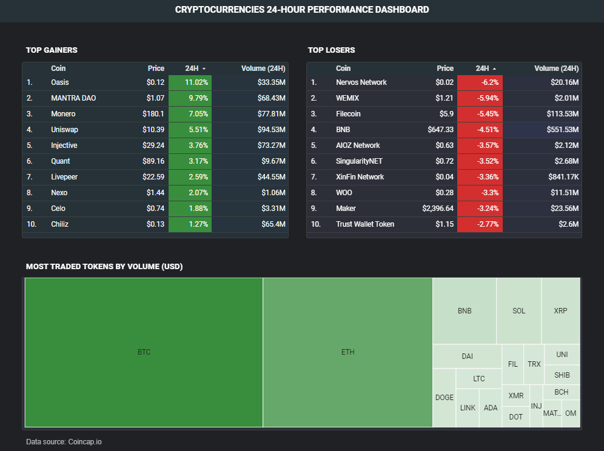

# Crytolytics: Coincap Data Extraction and Analysis Pipeline

## Introduction
In today's data-driven world, data plays a pivotal role in shaping decisions within organizations. The sheer volume of data generated necessitates data engineers to efficiently centralize data, clean and model data to align with specific business requirements, and also make the data easily accessible for data consumers.

The aim of this project is to build an automated data pipeline that retrieves cryptocurrency data from the CoinCap API, processes and transforms it for analysis, and presents key metrics on a near-real-time* dashboard. The dashboard provides users with valuable insights into the dynamic cryptocurrency market.

> **near-real-time because the data is loaded from the source and processed every 5 minutes rather than instantly*

## Dataset
This data used in this project was obtained from the [CoinCap API](https://docs.coincap.io/#51da64d7-b83b-4fac-824f-3f06b6c8d944), which provides real-time pricing and market activity for over 1,000 cryptocurrencies.

## Tools & Technologies used:
* Cloud: **Google Cloud Platform (GCP)**
* Infrastructure as Code (Iac): **Terraform**
* Containerization: **Docker, Docker Compose**
* Workflow Orchestration: **Apache Airflow**
* Data Lake: **Google Cloud Storage (GCS)**
* Data Warehouse: **Big Query**
* Data Transformation: **Data Build Tool (DBT)**
* Visualization: **Looker Studio**
* Programming Language: **Python (batch processing), SQL (data transformation)**

## Data Architecture

<div style="text-align: center;">
  
</div><br/>

Project Map:
1. **Provisioning Resources**: Terraform is used to set up the necessary GCP resources, including a Compute Engine instance, GCS bucket, and BigQuery datasets
2. **Data Extraction**: Every 5 minutes, JSON data is retrieved from the CoinCap API and converted to Parquet format for optimized storage and processing
3. **Data Loading**: The converted data is stored in Google Cloud Storage, the data lake, and then loaded into BigQuery, the data warehouse.
4. **Data Transformation**: DBT is connected to BigQuery to transform the raw data, after which the processed data is loaded back into BigQuery; with the entire ELT process  automated and orchestrated using Apache Airflow
5. **Reporting**: The transformed dataset is used to create an analytical report and visualizations in Looker Studio


## Dashboard

<div style="text-align: center;">
  
  <p>
    <a href="https://lookerstudio.google.com/reporting/70e4d913-0ff9-4dee-b544-fcd8795a7770">Go to Dashboard</a>
  </p>
</div>

> *Disclaimer: This is a personal project, so please do not make actual financial decisions based on this dashboard. T for thanks!*

---

## How to Replicate the Data Pipeline 
Below are steps on how to reproduce this pipeline in the cloud. Note, that, Windows/WSL/Gitbash was used locally for this project.

#### 1. Set up Google Cloud Platform (GCP)
  - If you don't have a GCP account already, create a free trial account (you get free $300 credits) by following the steps [in this guide](https://www.googleadservices.com/pagead/aclk?sa=L&ai=DChcSEwjJ46z7nYv-AhURpLIKHROYA1EYABAAGgJscg&ohost=www.google.com&cid=CAASJeRojfEdEgjhUdavw-D6EgMxjah19w2TX2qQ3r70Et_NIAuN_L0&sig=AOD64_3k4xtbQ41NOlfBdXDrxSAO3RdG-A&q&adurl&ved=2ahUKEwiG6aT7nYv-AhX9QvEDHZlUD0gQ0Qx6BAgKEAE)
  - Create a new project on GCP ([see guide](https://cloud.google.com/resource-manager/docs/creating-managing-projects)) and take note of your Project ID, as it will be needed at the later stages of the project
  - Next is to enable necessary APIs for the project, create and configure a service account, and generate an auth-key. While all of these can be done via the GCP Web UI ([see](https://github.com/MichaelShoemaker/shoemaker-de-zoomcamp-final-project/blob/main/GitLikeMe.md)), Terraform will be used to run the processes (somebody say DevOps, hehehe). So skip for now.
  - If you haven't already, download and install the Google Cloud SDK for local setup. You can follow [this installation guide](https://github.com/DataTalksClub/data-engineering-zoomcamp/blob/main/01-docker-terraform/1_terraform_gcp/windows.md).
      * You might need to restart your system before gcloud can be used via CLI. Check if the installation is successful by running `gcloud -v` in your terminal to view the version of the gcloud installed
      * Run `gcloud auth login`  to authenticate the Google Cloud SDK with your Google account

#### 2. Generate the SSH Key Pair Locally
The SSH Key will be used to connect and gain access to the gcp virtual machine via the local terminal (Linux). In your terminal run the command <br>
`ssh-keygen -t rsa -f ~/.ssh/<whatever-you-want-to-name-your-key> -C <the-username-that-you-want-on-your-VM> -b 2048`

ex: `ssh-keygen -t rsa -f ~/.ssh/ssh_key -C aayomide -b 2048`

#### 3. Provision the Needed GCP Resources via Terraform. 
Follow the [terraform reproduce guide](/setup/terraform_setup.md)

#### 4. Create an SSH connection to the newly created VM (on your local machine)
Create a file called config within the .ssh directory in your home folder and paste the following information:

    ```
    HOST <vm-name-to-use-when-connecting>
        Hostname <external-ip-address>   # check the terraform output in the CLI or navigate to GCP > Compute Engine > VM instances.
        User <username used when running the ssh-keygen command>  # it is also the same as the gce_ssh_user
        IdentityFile <absolute-path-to-your-private-ssh-key-on-local-machine>
        LocalForward 8080 localhost:8080     # forward traffic from local port 8080 to port 8080 on the remote server where Airflow is running
    ```
    for example:
  
    ```
    HOST cryptolytics_vm
        Hostname 35.225.33.44
        User aayomide
        IdentityFile c:/Users/aayomide/.ssh/ssh_key
        LocalForward 8080 localhost:8080
    ```
Afterward, connect to the virtual machine via your local terminal by running `ssh cryptolytics_vm`. 

You can also access to the VM via VS code as shown [here](https://github.com/AliaHa3/data-engineering-zoomcamp-project/blob/main/setup/gcp_vm.md#connecting-and-setting-up)


> Note: the value of the external ip address changes as you turn the VM instance on and off

#### 5: Setup DBT (data build tool).
Follow the [dbt how-to-reproduce guide](/setup/dbt_setup.md)

#### 6. Orchestrate the dataflow with Airflow. 
Follow the  [airflow how-to-reproduce guide](/setup/airflow_setup.md)

#### 7. Create a report in Looker Studio:
You can use any data visualization tool of your choice to access the data in the newly created table. In this case, Looker Studio was used, and set up to access the "prod_coins_dataset" dataset in Big Query.
- Log in to [Looker Studio](https://lookerstudio.google.com/navigation/reporting) using your google account
- Click on "Blank report" and select the "BigQuery" data connector
- Choose your data source (project -> dataset), which in this case is "prod_coins_dataset"


## Further Improvements
* Use Apache Kafka to stream the data in real-time
* Perform advanced data transformation using DBT or even use PySpark
* Implement more robust error handling with try-catch blocks and write more robust data quality tests in DBT
* Pipeline alerting & monitoring feature

## Resources
- [DataTalks.Club](https://datatalks.club/blog/data-engineering-zoomcamp.html) 
- [Data Engineering Zoomcamp](https://github.com/DataTalksClub/data-engineering-zoomcamp)
- [Michael Shoemaker animated dataflow architecture youtube tutorial](https://youtu.be/fBYY08Zp9LQ?si=8pFSg9KRNJ5y-rW8)
  - Instead of installing the Peek screen recorder via the terminal as done in the video, I downloaded the app from the Microsoft store [here](https://apps.microsoft.com/detail/xp8cd3d3q50ms2?hl=en-us&gl=NG)

  <!-- - draw.io to create the architecture and animate the arrows -->
  <!-- - Pictures for Architecture diagram: https://www.svgrepo.com/vectors/google-cloud/ -->
  <!-- - Remove image background (if needed): https://www.remove.bg/ -->