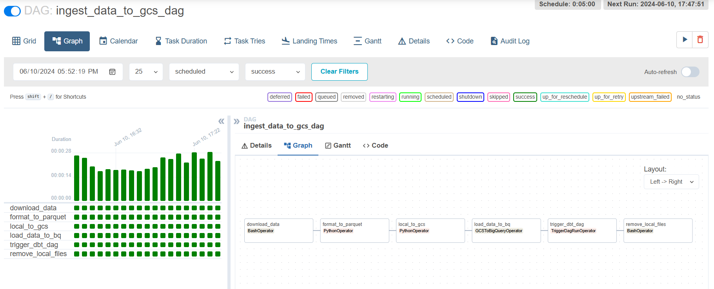

## Airflow Setup
Before running the DAG, ensure you have Docker and Docker Compose installed. If not, follow these steps in your VM:
* Navigate to the cloned repository: `cd ~/crypto_analytics_engineering`
* Install Docker and Docker Compose by running: `bash setup/scripts/docker_setup.sh`
    - You might need to log out and log back in for the docker-compose executable to be added to your PATH. Simply run `logout` and then `ssh cryptolytics_vm` to reconnect.

To run the DAG:
* Navigate to the airflow folder in the cloned project repository: `cd crypto_analytics_engineering/airflow`
* Create a `.env` file to specify your GCP project ID and bucket name. The file should have the following content: The `.env` file should have the following content

    ~~~

        AIRFLOW_UID=500000
        GCP_PROJECT_ID= <your-project-id>
        GCP_GCS_BUCKET= <your-gcs-bucket-name>

    ~~~      
* Next, run the following docker commands in the CLI:
    * `docker-compose build` to build the airflow docker image 
    * `docker-compose up airflow-init` to initialize the airflow scheduler, database, etc.
    * `docker-compose up` to start all airflow services from the containers 

This will trigger the `ingest_transform_data.py` DAG to start running every 5 minutes. The extracted data is partitioned by timestamp and stored in GCS as raw Parquet files. The latest data is then loaded into a BigQuery table, after which DBT is used to perform transformations and modeling on the data.

To view the Airflow web UI, open a browser and go to [http://localhost:8080/](http://localhost:8080/), the username and password are both **airflow**. From there, you can monitor the status of the DAG and its tasks. 

You can also start the DAG manually by clicking the "Trigger DAG" button on the DAG's page in the Airflow web UI.

When done with the orchestration, shut down the Airflow container by running: `docker-compose down`.

----
### DAG

<!-- `docker stop $(docker ps -a -q)` to stop all running containers -->
<!-- `docker rm $(docker ps -a -q)` to remove all running containers -->

